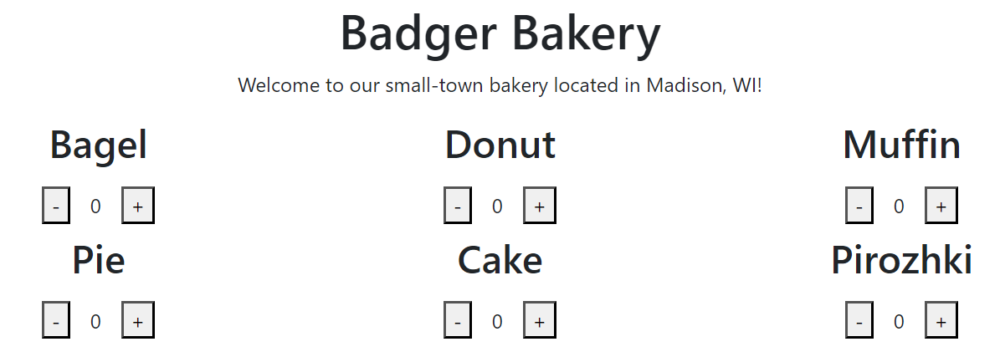
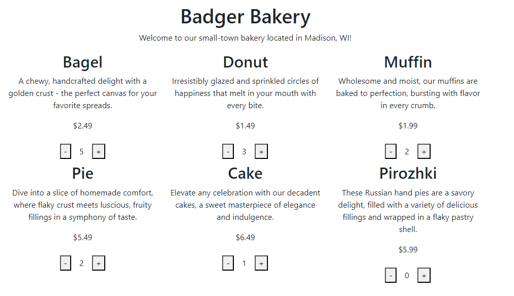
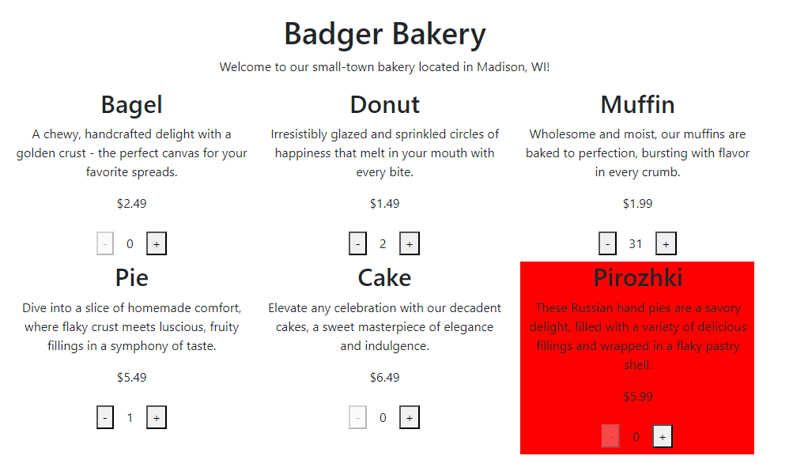

[](https://classroom.github.com/online_ide?assignment_repo_id=12076481&assignment_repo_type=AssignmentRepo)
# CS571-F23 HW3: Badger Bakery

Welcome back to Badger Bakery! In this homework, you'll create a new version of Badger Bakery using an API and React. In addition, you'll be fetching the bakery data rather than hardcoding it into the HTML. Finally, you will apply your knowledge of visual design to make a more eye-appealing webpage.

**Note:** The steps below show a barebones design. It's up to you (in the *visual design* portion of the assignment) to make a better design. See below for an *example* final solution.


## Setup

The starter code provided to you was generated using [vite](https://vitejs.dev/guide/). Furthermore, [bootstrap](https://www.npmjs.com/package/bootstrap) and [react-bootstrap](https://www.npmjs.com/package/react-bootstrap) have already been installed. **You should *not* re-run the  npm create vite command**. Instead, in this directory, simply run...

```bash
npm install
npm run dev
```

Then, in a browser, open `localhost:5173`. You should *not* open index.html in a browser; React works differently than traditional web programming! When you save your changes, they appear in the browser automatically. I recommend using [Visual Studio Code](https://code.visualstudio.com/) to do your development work.

The two components you will be working with, `BadgerBakery.jsx` and `BakedGood.jsx`, are located in the `components` folder.

## React Fundamentals

### 0. Fetch Baked Goods

**This step has already been done for you!**

In `BadgerBakery.jsx`, we use the `useEffect` hook to fetch data from the API and save it to a state variable `bakedGoods`. We then use `map` to display each `BakedGood`. In addition, we pass all four of the baked good attributes (`name`, `description`, `price`, and `featured`) to `BakedGood` as props.

In HW4, you will need to do something similar; for now this is given to you!



### 1. Display Baked Good Information

In `BakedGood.jsx`, in addition to the baked good's name, display its price and description.


### 2. Allow Adding/Removing of Baked Goods

In `BakedGood.jsx`, allow the user to be able to add and remove baked goods via the "+" and "-" buttons. Clicking "+" should increase the quantity while clicking "-" should decrease the quantity.

**Hint:** It may be helpful to replace the hardcoded 0 with a state variable which is changed by the `onClick` attribute of the buttons.



### 3. Prevent User Error

In `BakedGood.jsx`, add a `disabled` prop to the "-" button that disables the "-" button if the quantity is at or below `0`. There is no maximum number of items a user may add to their basket.


### 4. Highlight Featured Item

In `BakedGood.jsx`, highlight today's featured baked good by making its styling distinct from the other items. For example, you could change the background color, the font boldness, or anything else to distinguish it from the others.

A baked good is considered featured if its `featured` prop is `true`.



### 5. Fetch Featured Item

In `BadgerBakery.jsx`, display a line that says...

Today's featured item is ITEM for $PRICE!

...where ITEM and PRICE are replaced with the featured item name and price. You can do this by *either* (1) fetching the featured item from `https://cs571.org/api/f23/hw3/featured-baked-good` or (2) finding the featured item in the `bakedGoods` array. If you decide to find the featured item in the `bakedGoods` array, you may *not* assume the last item is the featured item; you must check for the `featured` prop.

You may assume that there is exactly 1 featured item at any given time. When the data is still fetching, simply display the text "Loading..." You will likely only see this loading text for a few milliseconds.

That's all for the React Fundamentals! There is no price/tax/total calculation in this assignment. Move on to **Visual Design**.


## Visual Design

Complete this part of the assignment *after* your complete the implementation of Badger Bakery. If you are unable to complete the implementation of Badger Bakery, complete this to the best of your ability.

Here, you will apply your knowledge of visual design to Badger Bakery. If a response asks you to upload a figure or attachment, include those underneath the `_figures` directory. Images can be included using the following markdown format: ``

1. Using your knowledge of visual design, improve your Badger Bakery interface. **This means changing your React code.** Following, describe at least 3 different design elements *or* principles that you used in your improved design. Add annotated screenshot(s) of the interface to show these design elements *or* principles.

    In an effort to improve the Badger Bakery interface, I first leveraged the design principle of `contrast` to create a distinct header section. The section features a captivating background image of a bakery, creating a stark juxtaposition against the white background employed by the remainder of the page.
    

    Next, employing the element of `size`, I decided to greatly increase the font size of the business, Badger Bakery, in the header of the interface. By doing so, I hoped site visitors would immediately recognize and focus on the brand identity.
      

    Finally, attempting to apply the element of `texture` to the site, I swapped the standard HTML default button with the Button component provided through `react-bootstrap`. This design decision imparts a number of interactive features on the `+` and `-` buttons, such as:
    changing color when hovered over, a darkening of color when clicked, and a smooth transtion of color when changing from disabled to active (and vice versa).
      

2. In design question 1, you were likely limited by your knowledge of React in what changes you could make. Now, think bigger. Use a hand-drawn or digital sketch to demonstrate an improved interface. Describe **3 elements and 3 principles**. You can re-use elements or principles from design question 1 as long as they are applied in a new way.

    When designing my sketch of the revised Badger Bakery, I sought to leverage the design principles of `movement`, `focal point`, and `balance` as well as the design elements of `value`, `shape` and `texture`.
      
    
    Design Principles:
    1) Movement
    ```
    Attained through a carousel of bakery images in the header.
    ```
    2) Focal Point
    ```
    Utilized with the featured item section where an image of the highlighted good stands out from the surrounding page.
    ```
    3) Balance
    ```
    Divided the page into more distinct sections (i.e. header, featured, items, more baked goods) to create a greater sense of visual balance.
    ```
    
    Design Elements:
    1) Value
    ```
    Employed through a fading header when you scroll; other additions could include the text of a baked good card darkening when hovered over with the mouse.
    ```
    2) Shape
    ```
    Observed in the new button to explore more baked goods.
    ```
    3) Texture
    ```
    By adding an image of the baked good, the various hues and tones contribute to the visual texture of the page.
    ```
## Done! 🥳

**Be sure that you have completed BOTH the React and Visual Design portions of this assignment.**

Congrats! Add, commit, and push your files to GitHub Classroom and paste your commit hash in the Canvas assignment.